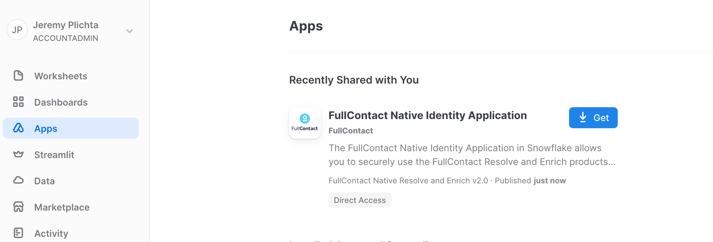

author: Alix Thoi
id: how_to_resolve_data_with_fullcontact_and_snowflake
summary: This is a sample Snowflake Guide
categories: Getting-Started
environments: web
status: Published 
feedback link: https://github.com/Snowflake-Labs/sfguides/issues
tags: Getting Started, Data Science, Data Engineering, Twitter 

# How To Resolve Rata with FullContact and Snowflake
<!-- ------------------------ -->
Duration: 1

## Overview 
As Snowflake is used more and more frequently as the central datawarehouse users often find themselves with duplicate copies of customer information in different tables. This guide shows how to use the FullContact for Snowflake Native Application to unify different pieces of customer data using the FullContact PersonID.

### Prerequisites
- A Snowflake Account that you have `ACCOUNTADMIN`
- Familiarity with Snowflake SQL

### What You’ll Learn 
- How to install the FullContact for Snowflake Native Application
- How to configure and setup the FullContact for Snowflake Native Application
- How to use the FullContact for Snowflake Native Application to unify and dedeuplicate multiple sources of customer data

### What You’ll Need 
- [Snowflake Account](https://signup.snowflake.com/) with `ACCOUNTADMIN` access
- [FullContact Trial Account](https://platform.fullcontact.com/register/offer/snowresolve)

### What You’ll Build 
- A unified customer dataset 

<!-- ------------------------ -->
## Install the FullContact for Snowflake App
Duration: 1

The FullContact for Snowflake Native App is available in the Snowlflake Marketplace

1) Visit the "Apps" section of your Snowflake Account - ex where YOURACCOUNTLOCATOR is your own Snowflake Account Locator https://app.snowflake.com/us-east-1/YOURACCOUNTLOCATOR/#/apps/applications




<!-- ------------------------ -->
## Creating a FullContact account and API key
Duration: 1

A single sfguide consists of multiple steps. These steps are defined in Markdown using Header 2 tag `##`. 

```markdown
## Step 1 Title
Duration: 3

All the content for the step goes here.

## Step 2 Title
Duration: 1

All the content for the step goes here.
```

To indicate how long each step will take, set the `Duration` under the step title (i.e. `##`) to an integer. The integers refer to minutes. If you set `Duration: 4` then a particular step will take 4 minutes to complete. 

The total sfguide completion time is calculated automatically for you and will be displayed on the landing page. 

<!-- ------------------------ -->
## Configuring the FullContact for Snowflake App
Duration: 2

Look at the [markdown source for this sfguide](https://raw.githubusercontent.com/Snowflake-Labs/sfguides/master/site/sfguides/sample.md) to see how to use markdown to generate code snippets, info boxes, and download buttons. 

### JavaScript
```javascript
{ 
  key1: "string", 
  key2: integer,
  key3: "string"
}
```

### Java
```java
for (statement 1; statement 2; statement 3) {
  // code block to be executed
}
```

### Info Boxes
> aside positive
> 
>  This will appear in a positive info box.


> aside negative
> 
>  This will appear in a negative info box.

### Buttons
<button>

  [This is a download button](link.com)
</button>

### Tables
<table>
    <thead>
        <tr>
            <th colspan="2"> **The table header** </th>
        </tr>
    </thead>
    <tbody>
        <tr>
            <td>The table body</td>
            <td>with two columns</td>
        </tr>
    </tbody>
</table>

### Hyperlinking
[Youtube - Halsey Playlists](https://www.youtube.com/user/iamhalsey/playlists)

<!-- ------------------------ -->
## Prepping the data 
Duration: 2

Look at the [markdown source for this guide](https://raw.githubusercontent.com/Snowflake-Labs/sfguides/master/site/sfguides/sample.md) to see how to use markdown to generate these elements. 

### Images


### Videos
Videos from youtube can be directly embedded:
<video id="KmeiFXrZucE"></video>

### Inline Surveys
<form>
  <name>How do you rate yourself as a user of Snowflake?</name>
  <input type="radio" value="Beginner">
  <input type="radio" value="Intermediate">
  <input type="radio" value="Advanced">
</form>

### Embed an iframe


<!-- ------------------------ -->
## Assign PersonID by Resolving Sample Data
Duration: 1

At the end of your Snowflake Guide, always have a clear call to action (CTA). This CTA could be a link to the docs pages, links to videos on youtube, a GitHub repo link, etc. 

If you want to learn more about Snowflake Guide formatting, checkout the official documentation here: [Formatting Guide](https://github.com/googlecodelabs/tools/blob/master/FORMAT-GUIDE.md)

### What we've covered
- creating steps and setting duration
- adding code snippets
- embedding images, videos, and surveys
- importing other markdown files

<!-- ------------------------ -->
## Conclusion
Duration: 1

At the end of your Snowflake Guide, always have a clear call to action (CTA). This CTA could be a link to the docs pages, links to videos on youtube, a GitHub repo link, etc. 

If you want to learn more about Snowflake Guide formatting, checkout the official documentation here: [Formatting Guide](https://github.com/googlecodelabs/tools/blob/master/FORMAT-GUIDE.md)

### What we've covered
- creating steps and setting duration
- adding code snippets
- embedding images, videos, and surveys
- importing other markdown files