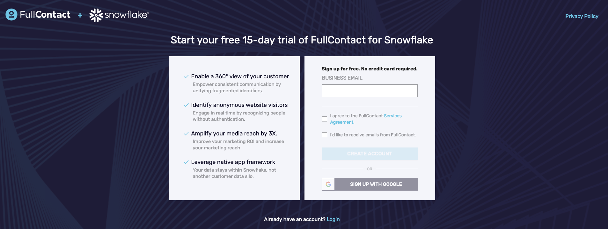
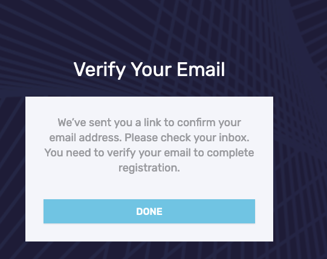

author: Alix Thoi
id: how_to_resolve_data_with_fullcontact_and_snowflake
summary: This is a sample Snowflake Guide
categories: Getting-Started
environments: web
status: Published 
feedback link: https://github.com/Snowflake-Labs/sfguides/issues
tags: Getting Started, Data Science, Data Engineering, Twitter 

# How To Resolve Rata with FullContact and Snowflake
<!-- ------------------------ -->
Duration: 1

## Overview 
As Snowflake is used more and more frequently as the central datawarehouse users often find themselves with duplicate copies of customer information in different tables. This guide shows how to use the FullContact for Snowflake Native Application to unify different pieces of customer data using the FullContact PersonID.

### Prerequisites
- A Snowflake Account that you have `ACCOUNTADMIN`
- Familiarity with Snowflake SQL

### What You’ll Learn 
- How to install the FullContact for Snowflake Native Application
- How to configure and setup the FullContact for Snowflake Native Application
- How to use the FullContact for Snowflake Native Application to unify and dedeuplicate multiple sources of customer data

### What You’ll Need 
- [Snowflake Account](https://signup.snowflake.com/) with `ACCOUNTADMIN` access
- [FullContact Trial Account](https://platform.fullcontact.com/register/offer/snowresolve)

### What You’ll Build 
- A unified customer dataset 

<!-- ------------------------ -->
## Install the FullContact for Snowflake App
Duration: 1

The FullContact for Snowflake Native App is available in the Snowlflake Marketplace

1) Visit the "Apps" section of your Snowflake Account - ex where YOURACCOUNTLOCATOR is your own Snowflake Account Locator https://app.snowflake.com/us-east-1/YOURACCOUNTLOCATOR/#/apps/applications


2) Under the "Recently Shared with You" click the "Get" button next to the FullContact Native Identity Application

3) Choose the warehouse to use to run the install scripts (an XS warehouse works fine). 

4) Expand the Options dropdown, where you are able to name the application anything you would like.  We have named the app "FC_NATIVE_APP".  This is the app name we use in the SQL queries we provide post installation of the application in a Snowsight worksheet to help you complete the installation.  


5) Click the Get button to install the application.  The Get button will be deactivated while installing.  There is not currently a loader that displays to give a sense for how the installation is progressing - the installers typically complete within 1-2 minutes.   

6) Once installation is complete, you will see a confirmation modal.  


7) Click the **Open** button, which will open a worksheet pre-populated with the queries you will need to complete the installation.

<!-- ------------------------ -->
## Complete configuration of FullContact App
Once installed there are a few more steps that need to be complete before the FullContact for Snowflake application can function. Follow these instructions by pasting and running the following SQL in a new SQL worksheet.

1) Create and grant access to API INTEGRATION

> aside positive
> 
>  The `API INTEGRATION` is used to check your license key, allowed usage, and report usage summary counts back to FullContact. Your raw data never leaves Snowflake as the app executes nativly and FullContact will not have access to your raw data unless you decide to share it with us using a normal secure share.

```sql
CREATE API INTEGRATION IF NOT EXISTS FC_API_INT_FULLCONTACT_IDENTITY_SOLUTIONS
    API_PROVIDER = aws_api_gateway
    API_AWS_ROLE_ARN = 'arn:aws:iam::966965295085:role/cx-blizzard-snowflake'
    API_ALLOWED_PREFIXES = ('https://um58694ui8.execute-api.us-east-1.amazonaws.com/blizzard-default/v3')
    ENABLED = true;

-- Grant access to allow a specific user or role to use this application
GRANT USAGE ON INTEGRATION FC_API_INT_FULLCONTACT_IDENTITY_SOLUTIONS TO APPLICATION FC_NATIVE_APP;
GRANT APPLICATION ROLE FC_NATIVE_APP.FC_USER TO ROLE ACCOUNTADMIN;
```

2) Install and define the `EXTERNAL FUNCTIONS` that the application needs to run. 

```sql
-- Install the EFs (external functions) that the app needs to run:
-- install EFs
CALL FC_NATIVE_APP.APP_SCHEMA.CREATE_EF_GET_DATAPACKS('FC_API_INT_FULLCONTACT_IDENTITY_SOLUTIONS');
CALL FC_NATIVE_APP.APP_SCHEMA.CREATE_EF_GET_OAUTH_GROUP_LIST('FC_API_INT_FULLCONTACT_IDENTITY_SOLUTIONS');
CALL FC_NATIVE_APP.APP_SCHEMA.CREATE_EF_GET_OAUTH_GROUP_MEMBER_LIST('FC_API_INT_FULLCONTACT_IDENTITY_SOLUTIONS');
CALL FC_NATIVE_APP.APP_SCHEMA.CREATE_EF_GET_PRODUCT_USAGE('FC_API_INT_FULLCONTACT_IDENTITY_SOLUTIONS');
CALL FC_NATIVE_APP.APP_SCHEMA.CREATE_EF_PUT_USAGE('FC_API_INT_FULLCONTACT_IDENTITY_SOLUTIONS');
```


<!-- ------------------------ -->
## Creating a FullContact account and API key
Duration: 2

In order to use the FullContact for Snowflake Application you need a license (API) key. Follow these instructions to get one for free and use the generated key in the next sections.

1) Visit the [FullContact for Snowflake Offer Page](https://platform.fullcontact.com/register/offer/snowresolve)



2) Enter your business email address and click "Create Account". Once complete you should see a page directing you to check your email.



3) Check your email to find a "Welcome to FullContact" email. Click the "Verify This Email Address" button to setup your initial password


4) Choose your new Password and complete the short "Tell Us About Your Business Form"

5) Once the form is complete you will be logged into the FullContact Platform. Click the "API Keys" menu option on the left hand side.


6) Click the "+ Generate API Key" button, verify your phone number via SMS then name your key (we used `Snowflake Key` in this example)


7) Click the copy button to copy the value of the key into a secure location for the next step (a notepad or file would work)


<!-- ------------------------ -->
## Configuring the FullContact for Snowflake App
Duration: 2

Look at the [markdown source for this sfguide](https://raw.githubusercontent.com/Snowflake-Labs/sfguides/master/site/sfguides/sample.md) to see how to use markdown to generate code snippets, info boxes, and download buttons. 

### JavaScript
```javascript
{ 
  key1: "string", 
  key2: integer,
  key3: "string"
}
```

### Java
```java
for (statement 1; statement 2; statement 3) {
  // code block to be executed
}
```

### Info Boxes
> aside positive
> 
>  This will appear in a positive info box.


> aside negative
> 
>  This will appear in a negative info box.

### Buttons
<button>

  [This is a download button](link.com)
</button>

### Tables
<table>
    <thead>
        <tr>
            <th colspan="2"> **The table header** </th>
        </tr>
    </thead>
    <tbody>
        <tr>
            <td>The table body</td>
            <td>with two columns</td>
        </tr>
    </tbody>
</table>

### Hyperlinking
[Youtube - Halsey Playlists](https://www.youtube.com/user/iamhalsey/playlists)

<!-- ------------------------ -->
## Prepping the data 
Duration: 2

Look at the [markdown source for this guide](https://raw.githubusercontent.com/Snowflake-Labs/sfguides/master/site/sfguides/sample.md) to see how to use markdown to generate these elements. 

### Images


### Videos
Videos from youtube can be directly embedded:
<video id="KmeiFXrZucE"></video>

### Inline Surveys
<form>
  <name>How do you rate yourself as a user of Snowflake?</name>
  <input type="radio" value="Beginner">
  <input type="radio" value="Intermediate">
  <input type="radio" value="Advanced">
</form>

### Embed an iframe


<!-- ------------------------ -->
## Assign PersonID by Resolving Sample Data
Duration: 1

At the end of your Snowflake Guide, always have a clear call to action (CTA). This CTA could be a link to the docs pages, links to videos on youtube, a GitHub repo link, etc. 

If you want to learn more about Snowflake Guide formatting, checkout the official documentation here: [Formatting Guide](https://github.com/googlecodelabs/tools/blob/master/FORMAT-GUIDE.md)

### What we've covered
- creating steps and setting duration
- adding code snippets
- embedding images, videos, and surveys
- importing other markdown files

<!-- ------------------------ -->
## Conclusion
Duration: 1

At the end of your Snowflake Guide, always have a clear call to action (CTA). This CTA could be a link to the docs pages, links to videos on youtube, a GitHub repo link, etc. 

If you want to learn more about Snowflake Guide formatting, checkout the official documentation here: [Formatting Guide](https://github.com/googlecodelabs/tools/blob/master/FORMAT-GUIDE.md)

### What we've covered
- creating steps and setting duration
- adding code snippets
- embedding images, videos, and surveys
- importing other markdown files